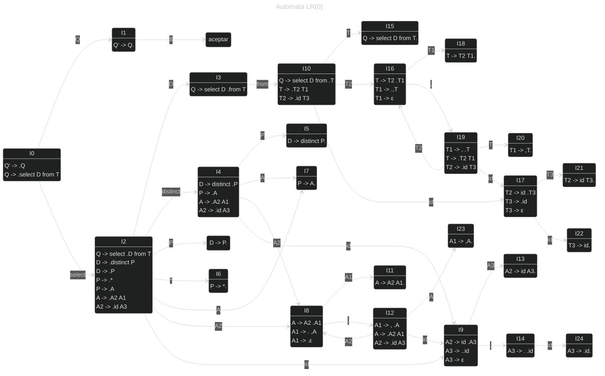

# Compiladores
Interprete del lenguaje SQL utilizando un analizador sintactico acendente no recursivo.

## Gramatica utilizada

1. Q    -> select D from T
2. D    -> distinct P 
3. D	-> P
4. P    -> *
5. P	->A
6. A    -> A2 A1
7. A1	-> , A 
8. A1	->ε
9. A2	-> id A3
10. A3	-> . id
11. A3	->ε
12. T    -> T2 T1
13. T1	-> , T
14. T1	->ε
15. T2 	-> id T3
16. T3 	-> id
17. T3	->ε

## Automata

